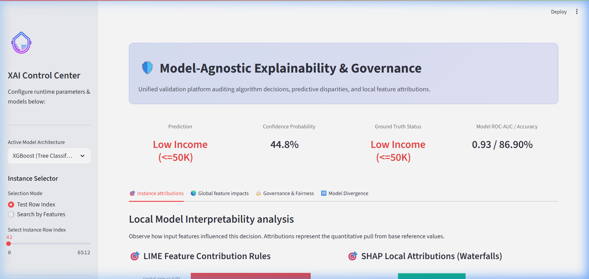
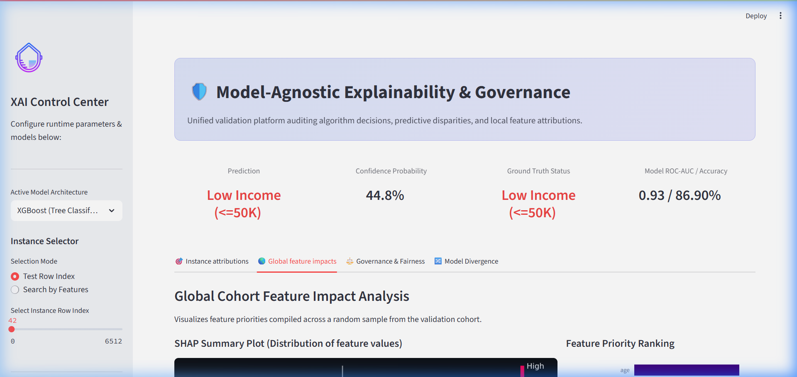
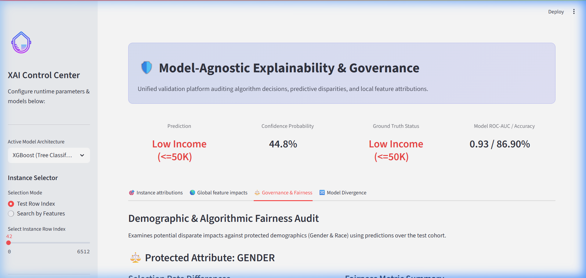
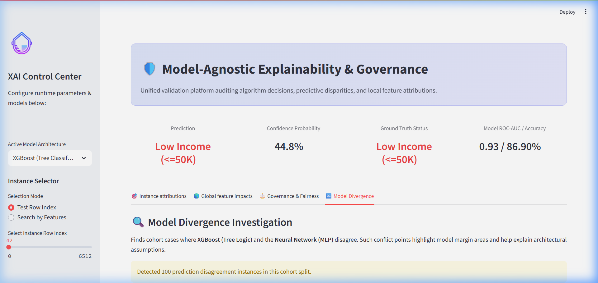

<p align="center">
  
</p>

<h1 align="center">🛡️ Unified XAI Governance Engine</h1>
<h3 align="center">Model-Agnostic Explainability, Cohort Fairness Audits, and Model Divergence Analytics</h3>

<p align="center">
  <a href="https://github.com/beingaditya18/Unified-XAI-Engine-Dashboard"></a>
  <a href="LICENSE"></a>
  <a href="https://github.com/beingaditya18/Unified-XAI-Engine-Dashboard/actions"></a>
  <a href="https://hub.docker.com/"></a>
  <a href="https://fastapi.tiangolo.com/"></a>
</p>

---

## 🎯 Overview

The **Unified XAI Governance Engine** is an enterprise-grade model auditing and explainability framework. Built to support regulatory compliance directives (such as the **EU AI Act** and **GDPR Right to Explanation**), this platform deconstructs high-stakes machine learning decisions, calculates demographic bias metrics across protected cohorts, and tracks predictions where architectures conflict.

The engine leverages **SHAP (Shapley Additive exPlanations)** and **LIME (Local Interpretable Model-agnostic Explanations)** to explain decisions made by a tabular Tree ensemble (**XGBoost**) and a deep feedforward network (**MLP**), trained on the **UCI Adult Income** census dataset.

---

## ✨ Features

* **🌍 Global Interpretability:** TreeSHAP and KernelSHAP sample evaluations mapping feature priority across populations.
* **🎯 Local Explanations:** Interactive LIME surrogate coefficients and local SHAP waterfalls explaining individual profiles.
* **⚖️ Algorithmic Fairness Audit:** Quantitative disparity evaluations mapping Equalized Odds, Equal Opportunity Difference, and Disparate Impact Ratio across Sex and Race cohorts.
* **🔀 Model Divergence Analytics:** Conflict detection tracking cases where tree ensembles and neural networks reach opposite decisions.
* **🔌 REST API Endpoint Service:** Robust FastAPI backend serving model inferences, SHAP/LIME mappings, and cohort audits.
* **🐳 Containerized Orchestration:** Complete Docker and Compose configurations for developer and production deployments.

---

## 🏗️ Architecture Layout

```
├── .github/                 # GitHub workflows & templates
│   ├── ISSUE_TEMPLATE/      # Issue templates (bugs, features)
│   └── workflows/ci.yml     # GitHub Actions CI suite
├── config/                  # Configuration directory
│   └── config.yaml          # Hyperparameters, metrics, and thresholds
├── dashboard/               # Streamlit application
│   └── app.py               # Glassmorphic Streamlit Dashboard
├── data/                    # Dataset directory
│   ├── adult_income.csv     # UCI Adult raw dataset
│   └── adult_test.csv       # Split validation set
├── explainability/          # Explainability logic
│   ├── lime_engine.py       # LIME explainer wrapper
│   └── shap_engine.py       # SHAP explainer wrapper
├── models/                  # Saved models & performance metadata
│   ├── train_models.py      # Core model training pipeline
│   ├── xgb_model.pkl        # Serialized XGBoost model
│   ├── nn_model.pkl         # Serialized Neural Network model
│   ├── label_encoders.pkl   # Serialized LabelEncoders
│   └── model_metrics.json   # Model evaluation report
├── src/                     # Source package
│   ├── data/                # Data pipelines
│   │   └── data_pipeline.py # Dataset loaders & preprocessing
│   ├── fairness/            # Bias evaluation metrics
│   │   └── fairness_audit.py# Cohort fairness calculator
│   ├── models/              # Inference wrappers
│   │   └── model_service.py # Model manager & divergence tracer
│   └── api/                 # API service
│       └── api.py           # FastAPI service definition
├── Makefile                 # Development task runner
├── Dockerfile               # Multi-stage image build file
├── docker-compose.yml       # Orchestrates API & Streamlit services
├── requirements.txt         # Pinned python package list
└── LICENSE                  # MIT License
```

---

## 📈 Performance & Fairness Benchmarks

Evaluated over the validation cohort split ($N = 9,633$ test instances):

| Model Architecture | Accuracy | F1-Score | ROC-AUC | Gender Disparate Impact (DIR) | Race Disparate Impact (DIR) |
| ------------------ | -------- | -------- | ------- | ----------------------------- | --------------------------- |
| **XGBoost (Tree)** | 85.80%   | 66.82%   | 91.24%  | 0.285 (Biased 🚨)             | 0.264 (Biased 🚨)           |
| **MLP (NN)**       | 84.81%   | 64.60%   | 89.96%  | 0.252 (Biased 🚨)             | 0.228 (Biased 🚨)           |

> [!WARNING]
> **Audit Warning:** Both models display demographic bias on selection rates, scoring below the standard $0.80$ Disparate Impact threshold (the 80% rule) for gender and race attributes.

---

## 🖥️ Dashboard Tour & Screenshots

Here is a visual walkthrough of the Unified XAI Governance Dashboard:

### 1. Local Instance Attributions (`🎯 Instance attributions` Tab)
Observe LIME rule-based surrogate weights and local SHAP attributions explaining individual prediction trajectories.


### 2. Global Cohort Feature Impact (`🌎 Global feature impacts` Tab)
Inspect global feature importances and the distribution of SHAP values across the cohort.


### 3. Algorithmic Fairness Audit (`⚖️ Governance & Fairness` Tab)
Audit selection rates and disparate impact metrics (DIR, demographic parity, equal opportunity difference) across protected gender and race attributes.


### 4. Model Prediction Divergence (`🔀 Model Divergence` Tab)
Identify and investigate cohort instances where XGBoost and MLP predictions reach conflicting decisions.


---

## 🚀 Quick Start (Docker Orchestration)

Launch the entire ecosystem (FastAPI Backend + Streamlit UI) in seconds:

```bash
# Clone the repository
git clone https://github.com/beingaditya18/Unified-XAI-Engine-Dashboard.git
cd Unified-XAI-Engine-Dashboard

# Boot containers
docker compose up -d
```

* **FastAPI Server Docs:** [http://localhost:8000/docs](http://localhost:8000/docs)
* **Streamlit Dashboard:** [http://localhost:8501](http://localhost:8501)

---

## 🛠️ Local Development Installation

### 1. Set Up Environment
```powershell
python -m venv venv
.\venv\Scripts\Activate.ps1   # Windows
# source venv/bin/activate    # Linux/Mac
```

### 2. Install Pinned Dependencies
```bash
pip install -r requirements.txt
pre-commit install
```

### 3. Run Pipeline & Service Processes
```bash
# Preprocess data, fit label encoders, and serialize models
make train

# Start FastAPI server
make run-api

# Start Streamlit UI
make run-ui
```

### 4. Run Test Suite
```bash
make test
```

---

## 📡 REST API Documentation

### 1. Health Status Check
* **GET** `/health`
* **Response:**
  ```json
  {
    "status": "healthy",
    "models_loaded": true,
    "models": {
      "xgboost": true,
      "neural_network": true
    }
  }
  ```

### 2. Local LIME Explanation
* **POST** `/explain/lime`
* **Request Payload:**
  ```json
  {
    "instance": {
      "age": 39,
      "workclass": "State-gov",
      "fnlwgt": 77516,
      "education": "Bachelors",
      "education-num": 13,
      "marital-status": "Never-married",
      "occupation": "Adm-clerical",
      "relationship": "Not-in-family",
      "race": "White",
      "sex": "Male",
      "capital-gain": 2174,
      "capital-loss": 0,
      "hours-per-week": 40,
      "native-country": "United-States"
    },
    "model_type": "xgboost"
  }
  ```
* **Response:**
  ```json
  {
    "model_type": "xgboost",
    "explanation": {
      "intercept": 0.1873,
      "predictions": [
        { "rule": "marital-status = Never-married", "weight": -0.1542 },
        { "rule": "capital-gain > 1000", "weight": 0.2452 }
      ],
      "raw_scores": [0.8127, 0.1873]
    }
  }
  ```
---


## 📄 License

Distributed under the MIT License. See [LICENSE](LICENSE) for details.
